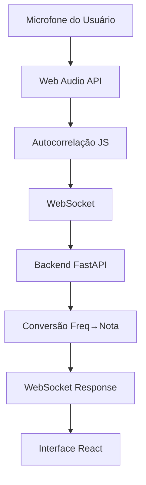

# 🎵 Pitch Training App

Um aplicativo web em tempo real para treinar afinação vocal usando Python (backend) e React (frontend).

## 📚 Sobre este Projeto

Este é meu **primeiro projeto full stack completo**, desenvolvido como parte dos meus estudos para me capacitar melhor em desenvolvimento de aplicações full stack. O projeto foi uma jornada de aprendizado onde explorei desde captura de áudio em tempo real até interfaces web modernas.

**Desenvolvimento com IA como Assistente:**
Durante o desenvolvimento, utilizei IA como ferramenta de **ajuda e orientação** no processo de aprendizado. A IA serviu como um mentor experiente, me guiando através dos conceitos, ajudando a entender as tecnologias e explicando o "porquê" por trás de cada decisão técnica. Cada linha de código foi compreendida e implementada com propósito educacional.

**Objetivos de Aprendizado Alcançados:**
- ✅ Integração Python + React em tempo real
- ✅ Processamento de áudio e análise de frequência
- ✅ WebSockets para comunicação bidirecional
- ✅ Interface moderna com TypeScript e TailwindCSS
- ✅ Estruturação e organização de projeto full stack
- ✅ Deploy e automação com scripts

## ✨ Funcionalidades

- 🎤 **Detecção de pitch em tempo real** usando microfone
- 🎼 **Conversão automática** de frequência para notas musicais
- 📊 **Gráfico de pitch em tempo real** com histórico
- 🎯 **Seletor de nota alvo** para treinamento de afinação
- 📱 **Interface web moderna** e responsiva
- 🔄 **Conexão WebSocket** para dados em tempo real
- ⚡ **Scripts automáticos** para iniciar/parar servidores

## 🚀 Como Usar (SUPER FÁCIL!)

### ⭐ Modo Automático (Recomendado)

**PowerShell (Melhor opção):**
1. **Inicie tudo com 1 clique:**
   ```powershell
   .\start.ps1
   ```

2. **Pare tudo com 1 clique:**
   ```powershell
   .\stop.ps1
   ```

**Ou CMD/Batch:**
1. **Inicie tudo:**
   ```cmd
   start.bat
   ```

2. **Pare tudo:**
   ```cmd
   stop.bat
   ```

3. **Acesse:** http://localhost:5173


## 📁 Estrutura do Projeto

```
sing-project/
├── 🚀 start.bat         # ⭐ INICIA TUDO AUTOMATICAMENTE
├── 🛑 stop.bat          # ⭐ PARA TUDO AUTOMATICAMENTE
├── ⚙️ setup.bat         # Configuração inicial
├── backend/             # Servidor Python (FastAPI)
│   ├── main_simple.py   # Detector de pitch (Windows)
│   ├── requirements.txt # Dependências Python
│   └── venv/            # Ambiente virtual
├── frontend/            # Cliente React (Vite)
│   ├── src/             # Código fonte React
│   └── package.json     # Dependências Node.js
└── README.md           # Este arquivo
```

## 🌐 Endpoints

- **🎨 Frontend:** http://localhost:5173
- **🔧 Backend API:** http://localhost:8001
- **📡 WebSocket:** ws://localhost:8001/ws
- **📋 Notas Disponíveis:** http://localhost:8001/notes

## 🚀 Deploy na Nuvem (Railway)

Este projeto está configurado para deploy automático no **Railway**. 

### 🌐 Versão Demo Online
**[👆 Acesse a Demo Aqui](https://sing-pitch-project-production.up.railway.app)** ✅ **FUNCIONANDO COM MICROFONE REAL!**

🎤 **Funcionalidade COMPLETA na nuvem:**
- **✅ Microfone real**: Captura áudio via Web Audio API no navegador
- **✅ Análise em tempo real**: Processamento de pitch em JavaScript + Python
- **✅ Interface completa**: Gráficos, seletor de notas, indicador de afinação
- **✅ Zero instalação**: Funciona direto no navegador


## 🛠️ Tecnologias

### Backend (Python)
- **FastAPI** - Escolhido por ser moderno, rápido e ter suporte nativo a WebSockets. Ideal para APIs assíncronas e documentação automática
- **WebSockets** - Necessário para comunicação em tempo real entre backend e frontend, enviando dados de pitch continuamente
- **NumPy** - Biblioteca essencial para computação científica e processamento eficiente de arrays de áudio
- **SoundDevice** - Melhor opção para captura de áudio do microfone em Python, com baixa latência
- **FFT (Fast Fourier Transform)** - Algoritmo fundamental para análise de frequência, convertendo sinal de áudio em espectro de frequências

### Frontend (React)
- **React 18 + TypeScript** - React para interface reativa e componentes reutilizáveis; TypeScript para tipagem estática e melhor experiência de desenvolvimento
- **Vite** - Build tool moderna
- **TailwindCSS** - Framework CSS utility-first para estilização rápida
- **Recharts** - Biblioteca específica para React para gráficos interativos
- **WebSocket Client** - Para conectar com backend e receber dados de pitch continuamente

### Por que esta Stack?
**Python no Backend:**
- Excelente ecossistema para processamento de áudio (NumPy, SciPy, SoundDevice)
- FastAPI oferece performance comparável ao Node.js com sintaxe mais limpa
- Facilita implementação de algoritmos de análise de frequência

**React no Frontend:**  
- Componentes reutilizáveis ideais para interface musical (seletor de notas, gráficos)
- Rico em bibliotecas de gráficos e UI
- TypeScript adiciona segurança de tipos essencial para dados de áudio

**WebSocket:**
- Latência mínima para dados de pitch em tempo real
- Comunicação bidirecional para futuras funcionalidades interativas

## 🎯 Como Funciona

1. **Backend** captura áudio do microfone
2. **Analisa a frequência** usando FFT
3. **Converte** para nota musical (Dó, Ré, Mi...)
4. **Envia via WebSocket** para o frontend
5. **Frontend** mostra em tempo real com gráficos

## 💡 Dicas de Uso

- 🎤 **Permita acesso ao microfone** quando solicitado
- 🎵 **Cante, assovie ou toque** um instrumento
- 🎯 **Selecione uma nota alvo** para treinar afinação
- 📊 **Observe o gráfico** para ver sua estabilidade
- ✅ **Meta:** manter dentro de ±10 cents da nota alvo

## 📚 Case Study: Evolução das Soluções

Este projeto demonstra **duas abordagens diferentes** para captura e análise de áudio em tempo real, cada uma com seus prós e contras:

### 🐍 **Abordagem 1: Backend Python (main.py)**
```
Microfone → SoundDevice → NumPy/Aubio → FFT → WebSocket
```

**✅ Vantagens:**
- Processamento robusto com bibliotecas especializadas
- Maior precisão na análise de frequência
- Controle total sobre algoritmos de DSP

**❌ Limitações:**
- Não funciona em servidores na nuvem
- Dependências de sistema (drivers de áudio)
- Restrito ao ambiente local

### 🌐 **Abordagem 2: Frontend JavaScript (App.tsx)**
```
Microfone → Web Audio API → Autocorrelação → WebSocket
```

**✅ Vantagens:**
- Funciona em qualquer lugar (local + nuvem)
- Sem dependências de sistema
- Processamento no navegador (privacidade)
- Menor latência

**❌ Limitações:**
- Algoritmos mais simples
- Limitado pela Web Audio API
- Menos controle fino sobre parâmetros

### 🎯 **Solução Híbrida Implementada:**

O projeto atual usa **ambas as abordagens** de forma inteligente:

1. **Desenvolvimento Local**: 
   - Frontend conecta em `localhost:8001`
   - Pode usar backend Python OU JavaScript
   
2. **Produção**:
   - Frontend detecta automaticamente a URL
   - Usa Web Audio API + WebSocket
   - Backend processa dados vindos do navegador

### 🔄 **Fluxo de Dados Atual:**



**Resultado**: App funciona **100% na nuvem** com microfone real! 🎉

## 🚀 Deploy na Nuvem (Railway)

